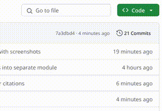
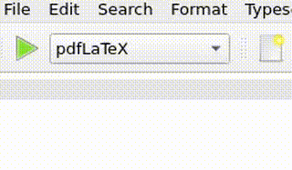
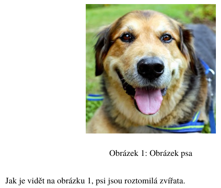
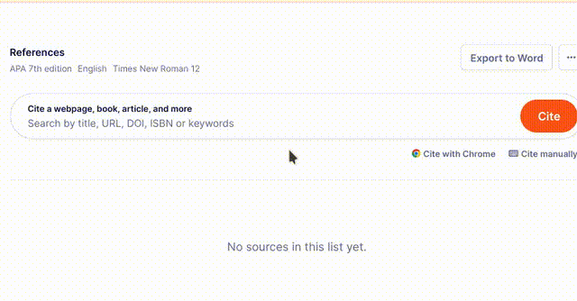
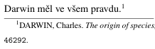

# EZTeX
<!-- sem prijde obrazek toho, jak to vypada -->

EZTeX je šablonová nadstavba nad LaTeX pro tvorbu seminárních, maturitních a
jiných prací. Jeho přednosti zahrnují:

- minimální nároky na uživatele
- typograficky korektní
- citace podle [ČSN ISO 690](https://www.iso690.zcu.cz/)

## Než začneme

Text, který právě čtete, je součástí dokumentace. **Pozorně si ho projděte, než
začnete EZTeX používat.**

Další sekce se věnují stažení, konfiguraci a užívání EZTeX k tvorbě dokumentů.
Předpokládá se:

- úspěšně nainstalovaná distribuce TeXu, např. [MiKTeX](https://miktex.org/)
- základní znalost systému TeX

## Jak stáhnout

EZTeX stáhneme kliknutím na tlačítko **Code** v horní části této stránky a poté
**Download ZIP**.



Archiv rozbalíme a přesuneme se do nově vzniklého adresáře.

## Prvotní nastavení

Všechna nastavení jsou rozdělena do dvou souborů: `metadata.tex` a
`moduly.tex`. Nastavení provádíme úpravou těchto souborů. **Změny pouze
ukládáme, nekompilujeme!**

### Metadata

Metadata nám dovolují specifikovat údaje jako autor, název práce apod. Každá
definice má následující formát:

```tex
\def\<klic>{%
<hodnota>
}
```

Přepsáním výchozích hodnot si dokument přizpůsobíme na míru. Některé údaje u
sebe mají komentář k jejich používání.

### Moduly

Moduly nejsou nic jiného než kusy kódu, které do dokumentu zavádí nějakou
funkčnost. Příkladem může být podpora obrázků, microtyping... V souboru má
každý modul následující tvar:

```tex
\input{moduly/<nazev>}
```

Všechny moduly jsou ve výchozím nastavení povoleny. **Toto je doporučeno
neměnit, pokud nevíte, co děláte.** Moduly lze zakázat zakomentováním
korespondujícího řádku.

## Užívání

V editoru [TeXworks](https://www.tug.org/texworks/) (či jiném, pokud to
preferujeme) otevřeme soubor `obsah.tex` a do něj píšeme náš text. **Tvorba
textu se od standardního LaTeXu v drobnostech liší, čtěte proto dále.**

Před kompilací se ujistíme, že máme jako překladač zvolený **LuaLaTeX** (ne
LuaTeX!). V TeXworks hledáme tuto nabídku v levém rohu horní lišty.



### Nadpisy

Nadpisy prvního řádu jsou nečíslované. EZTeX má pro ně vlastní příkaz
`\nsection{<nadpis>}`. Ten používejte místo klasického `\section{<nadpis>}`.

### Uvozovky

Pro uvozování textu poskytuje EZTeX příkaz `\enquote{<text>}` z knihovny
`csquotes`. Ten používejte místo doslovných uvozovek.

### Obrázky

Modul `obrazky.tex`poskytuje podporu pro grafiku a příkaz `\img`, kterým lze
obrázky vkládat. Povinnými parametry jsou popisek a cesta k souboru, volitelně
lze specifikovat výšku, resp. velikost.

```tex
\img[<vyska>]{<popisek>}{<soubor>}
```

Na obrázky se v textu odkazujeme pomocí příkazu `\ref{<identifikator>}`.
Identifikátor obrázku je shodný s jeho souborovým názvem. Příklad:

```tex
\img{Obrázek psa}{pes.jpg}
Jak je vidět na obrázku \ref{pes.jpg},
psi jsou roztomilá zvířata.
```



### Citace

Ujistěte se, že máte povolený modul `citace.tex`. Citační databázi tvoříme
pomocí služby [Scribbr](https://www.scribbr.com/citation/generator/). Na konci
klikneme na tři tečky v pravém horním rohu a vybereme **Export to LaTeX**.
Ujistíme se, že stahovaná databáze je ve formátu **BibTeX** (ne BibLaTeX!).



Soubor je nutné uložit jako `literatura.bib` do adresáře se zbytkem dokumentu.
**Pokud tak neučiníme, další kroky nebudou fungovat.**

Příkladem položky v databázi může být:

```bib
@book{darwin-1900,
	author = {Darwin, Charles},
	title = {{The origin of species, by Charles Darwin.}},
	year = {1900},
	doi = {10.5962/bhl.title.46292},
}
```

V textu se na publikace odkazujeme podle jejich identifikátoru (zde
`darwin-1900`). Používáme k tomu příkaz `\cite{<identifikator>}`. Pokud je po
nás vyžadováno citování v poznámce pod čarou, používáme
`\footfullcite{<identifikator>}`.



Úplné vykreslení citací v dokumentu je tak trochu krkolomné. Je nutné dokument
přeložit následujícím způsobem:

1. **LuaLaTeX** (tak, jak jsme zvyklí)
2. **BibTeX** (v TeXworks z nabídky vlevo nahoře)
3. **LuaLaTeX** (opět)
4. **LuaLaTeX** (a ještě jednou)

Toto není třeba dělat pokaždé, stačí jednou po vytvoření citační databáze a
poté po každé změně v ní.
