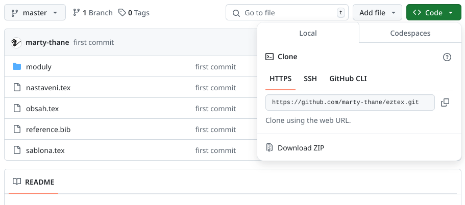
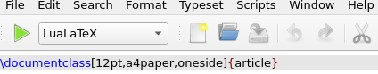

# EZTeX

EZTeX je šablonová nadstavba nad LaTeX pro tvorbu seminárních, maturitních a jiných prací. Jeho přednosti zahrnují:

- minimální nároky na uživatele
- plnění typografických norem
- citace podle [ČSN ISO 690](https://www.iso690.zcu.cz/)

## Než začneme

Text, který právě čtete, je součástí dokumentace. **Pozorně si ho přečtěte, než začnete EZTeX používat.**

Další sekce se věnují stažení, konfiguraci a užívání EZTeX k tvorbě dokumentů. Předpokládá se:

- úspěšně nainstalovaná distribuce TeXu, např. [MikTeX](https://miktex.org/)
- základní znalost systému TeX

<!-- predelat -->
## Jak stáhnout

EZTeX stáhneme kliknutím na tlačítko **Code** v horní části této stránky a poté **Download ZIP**. Archiv rozbalíme a přesuneme se do nově vzniklého adresáře.



## Prvotní nastavení

Všechna nastavení jsou rozdělena ve dvou souborech: `metadata.tex` a `moduly.tex`. Nastavení provádíme úpravou těchto souborů. Změny pouze ukládáme, nekompilujeme!

### Metadata 

Metadata nám dovolují specifikovat údaje jako autor, název práce apod. Každá definice má následující formát:
```tex
\def\<klic>{%
<hodnota>
}
```
Přepsání výchozích hodnot nám dovoluje přizpůsobit si dokument na míru. Některá metadata u sebe mají komentář k jejich používání.

### Moduly

Moduly nejsou nic jiného než kusy kódu, které do dokumentu zavádí nějakou funkčnost. Příkladem může být podpora obrázků, microtyping... V souboru má každý modul následující tvar:
```tex
\input{moduly/<nazev>}
```
Všechny moduly jsou ve výchozím nastavení povoleny. **Toto je doporučeno neměnit, pokud nevíte, co děláte.** Moduly lze zakázat zakomentováním korespondujícího řádku.

## Užívání

V editoru [TeXworks](https://www.tug.org/texworks/) (či jiném, pokud to preferujeme) otevřeme soubor `obsah.tex` a do něj píšeme náš text. **Tvorba textu se od standardního LaTeXu v drobnostech liší, nepřeskakujte proto sekci Další čtení.**

Před kompilací se ujistíme, že máme jako překladač zvolený **LuaLaTeX** (ne LuaTeX!). V TeXworks hledáme tuto nabídku v levém rohu horní lišty.



## Další čtení

- [Základní příkazy](navody/zaklady.md): Příkazy lišící se od standardního LaTeXu
- [Obrázky](navody/obrazky.md): Jak je vkládat a jak se na ně odkazovat
- [Citace](navody/citace.md): Jak citovat v textu
